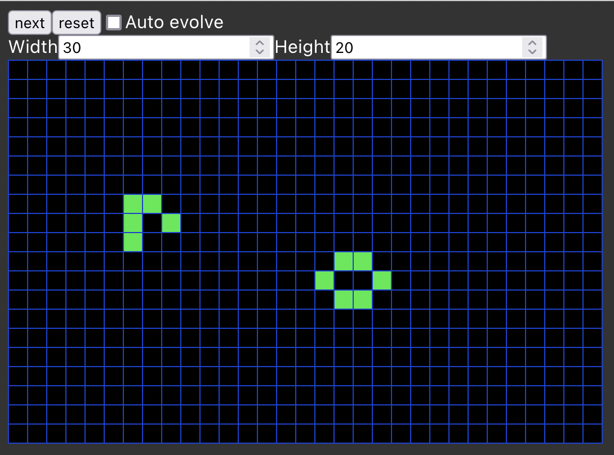

# Game of Life in Elm

This is an implementation of [Conway's Game of Life][1] written in Elm.

It renders a resizeable playing board whose state can be evolved by clicking the button.

Individual cells can be toggled dead or alive by clicking them.

## Setup

You'll need Elm installed to build this.

### Build

There is no special build tooling. The Elm compiler is used to spit out a .js file.

    elm make src/Main.elm --output=main.js

The html is static and expects a `main.js` to exist in its directory. The files can then be served by any http server.

There is a build script that will compile and copy the relevent files into a `build` directory. Just run `./build.sh` and point your webserver at `build/`.

[1]: https://en.wikipedia.org/wiki/Conway%27s_Game_of_Life
